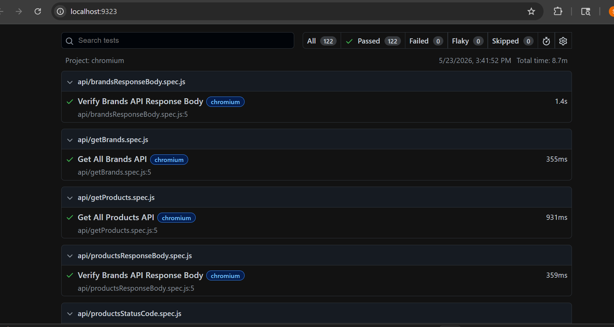
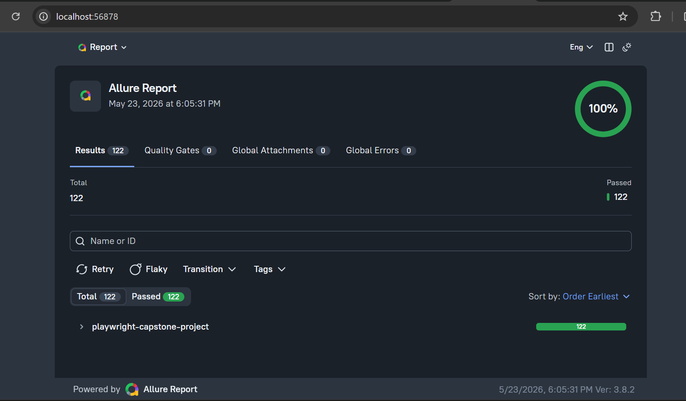

# Enterprise E-Commerce Automation Testing Framework

This project is an enterprise-grade Playwright automation framework developed as part of the Wipro SDET Playwright Capstone Project.

The framework automates multiple business workflows of an ecommerce application using Playwright and JavaScript with modern automation practices.

---

# Technology Stack

- Playwright
- JavaScript
- Node.js
- Git & GitHub
- HTML Reporting
- Allure Reporting
- API Testing

---

# Project Structure

```text
Playwright-Capstone-Project/
│
├── tests/
├── pages/
├── utils/
├── data/
├── docs/
├── screenshots/
├── playwright-report/
├── allure-results/
├── allure-report/
├── test-results/
├── playwright.config.js
├── package.json
└── README.md

Implemented Modules

Authentication Module
Product Module
Cart Module
Checkout Module
Contact Us Module
API Testing Module
Profile Module
Shipping Module
Payment Module

Features

Cross-browser testing
Parameterized testing
Data-driven testing
Soft assertions
Polling assertions
Authentication management
Screenshot capture on failure
HTML reporting
Allure reporting
Parallel execution
Reusable Page Objects (POM)
Robust locator strategies
Video recording on failure
Trace capture
API validation testing
Stable Chromium execution
122 automated test cases
GitHub version control

Test Scenarios Covered:

Authentication

Valid Login
Invalid Login
Signup Validation
Logout Validation
Data-Driven Login Testing

Product
Product Search
Product Details Validation
Product Metadata Validation
Product Quantity Validation
Multiple Product Validation
Search Input Validation

Cart & Checkout

Add To Cart
Remove From Cart
Empty Cart Validation
Checkout Validation
Multiple Product Cart Validation

UI Validation

Heading Validation
Button Visibility Validation
Navigation Validation
Modal Validation
Input Field Validation

Contact Us

Form Submission
Alert Handling
File Upload Validation

API Testing

GET API Validation
Status Code Validation
Response Body Validation
Brands API Validation
Products API Validation

Profile & Shipping

Login Navigation
Profile Visibility
Shipping Navigation
Footer/Header Validation
Subscription Validation

Payment

Payment UI Validation
Checkout Visibility
Payment Navigation Validation

Commands

Install Dependencies

npm install

Run All Tests

npx playwright test

Run Specific Test
npx playwright test tests/authentication/login.spec.js

Run In Chromium
npx playwright test --project=chromium

Run In Headed Mode
npx playwright test --headed

Run In UI Mode
npx playwright test --ui

Open HTML Report
npx playwright show-report

Open Allure Report
npx allure serve allure-results

Reporting

The framework supports:

HTML Reporting
Allure Reporting
Screenshots on Failure
Video Recording
Trace Capture
Stable Chromium Execution
Final Execution Result
122 / 122 Test Cases Passed
100% Stable Chromium Execution
Allure Report Successfully Generated
Project Documentation

# Project Screenshots

## HTML Report



## Allure Report



Project Planner PDF available inside:

/docs

Author

Sahil Alam

Wipro SDET Playwright Capstone Project


